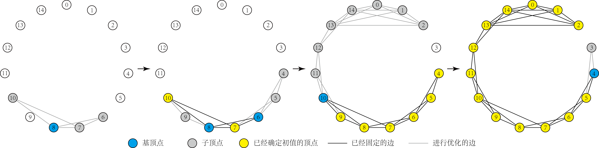
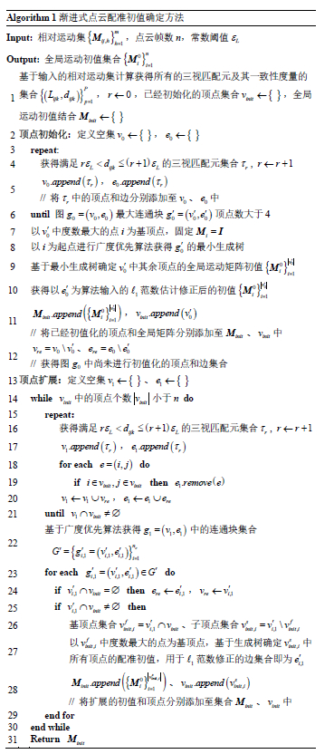

# HAInit_MA
一种适用于运动平均的渐进式初值确定方法，该方法计算运动关系图中三视匹配元一致性度量，逐步挑选最为可靠的匹配元进行顶点初值化与顶点扩展，有效避免了因所选初值与真值偏差较大导致加权运动平均效果不佳的问题；该方法同样适用于旋转平均
## 方法示意

## 算法流程图

## 使用
### 安装第三方库
[pcl 1.11](https://github.com/PointCloudLibrary/pcl)  
[boost](https://github.com/boostorg/boost)  
[vtk](https://github.com/Kitware/VTK)  
[Eigen 3.3.8](https://eigen.tuxfamily.org/index.php?title=Main_Page)  
[Sophus](https://github.com/strasdat/Sophus)  
[OpenMVG](https://github.com/openMVG/openMVG)  
### 编译
```
cd build
cmake ..
make
```
### 运行
```
cd ../bin  
./HAPipeline ../imagedata/BunnyData/Bunnyoverlop.txt ../imagedata/BunnyData/Bunny_ICPAns.txt ../imagedata/BunnyData/Bunny_Groundtruth.txt ../imagedata/Bunny_PCD 0.2 0.12 10
```
